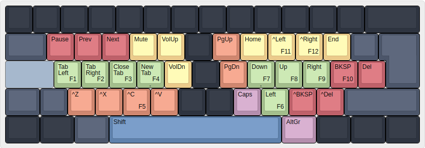
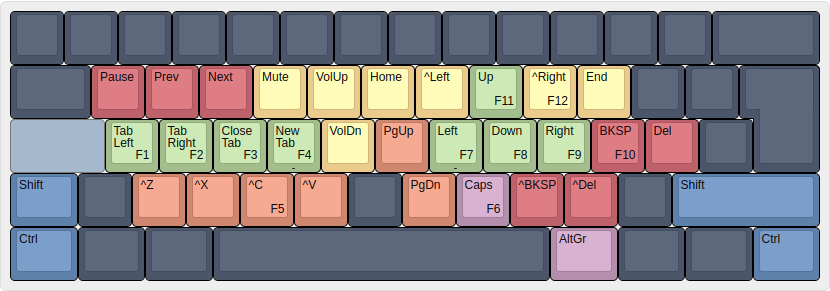

# gfkl/wokmok

gfkl/wokmok is a keyboard layout that I have created and use as my daily driver. It is intended to
make it very comfortable to type both regular english and programming languages. The layout uses
quite a fewer keys than standard layouts, making it possible to use for various custom keyboards.
Images are created with [this website](http://www.keyboard-layout-editor.com/).

### Contents
* [Current version](#current-version)
* [gfkl](#gfkl)
* [wokmok](#wokmok)
* [Analysis of wokmok](#analysis)
* [Layer 5](#layer-5)

## Current version

The color of a button indicates the finger used to press that button. Black keys are keys that I do
not like to press and have therefore disabled.

## gfkl

gfkl refers to any change compared to the original US keyboard layout that is not concerned with the
letters. For the layout of the letters see [Wokmok](#wokmok). Many of the changes have been inspired
by DreymaR's [Big Bag of Tricks](https://dreymar.colemak.org/). The following are some of the
changes that have been made compared to a regular keyboard layout.

* Any key that the right hand presses have been moved once to the right. Therefore, the distance
  from the edge of the keyboard to the right hand is equal to the distance from the edge of the
  keyboard to the left hand. This makes it way more comfortable to press enter, and rshift. It also
  makes it easier to utilize the altgr button with the right thumb.

* The numbers have been moved to the home row, such that they are easy to press. They are activated
  using the altgr button (layer 3). The slight annoyance by having to press altgr before typing
  numbers, is outweighed by the fact that the numbers are now at the home row.

* Some characters (not letters or numbers) are positioned such that they are independent of whether
  layer 3 is currently activated. This makes the annoyance of having to use altgr even smaller.

* The shift key have been moved to the space key, which emits the space character if clicked fast.
  This allows one to shift with the left thumb and press space with the right thumb. This removes
  work from the little fingers that are weak, and adds work to the underutized thumbs that are
  strong.

* What used to be the caps lock key now acts as a modifier for layer 5. If the button is clicked it
  acts as esc.

## wokmok

wokmok refers to the placement of the letters in the layout. wokmok has been through several
iterations and for the latest iteration, it is essentially a modification of the
[ISRT](https://notgate.github.io/layout/) keyboard layout. Wokmok was originally based on a
combination of [Colemak](https://colemak.com/) and [Workman](https://workmanlayout.org/) (which is
kinda how the name came to be). I had tried learning both of them but had a few minor issues with
both. I combined the features that I liked from both layouts (that are still present in the current
iteration), and tried different combinations of the lesser frequent keys. The asrtneio keys have
always been in their current location. At last, I found the by best configuration of letters I had
tried for my personal taste, simply by swapping the 'i' and 'a' columns in the ISRT layout and by
moving the punctuation characters back to their original positions.

## Analysis of wokmok

I tested the wokmok layout using the [DH
analyzer](https://colemakmods.github.io/mod-dh/analyze.html) and the
[stevepanalyzer](https://stevep99.github.io/keyboard-layout-analyzer/#/about). Wokmok generally scores
slightly better than Colemak, and slightly worse than the ISRT layout. For more details, see the
images inside the analyzer folder. For a detailed analysis of how the ISRT layout compares to
various Colemak layouts see [this](https://notgate.github.io/layout/).

## Layer 5

This layer is very nice. It is actived by holding the caps lock key. It is also inspired by
DreymaR's [Big Bag of Tricks](https://dreymar.colemak.org/). The '^' signalizes that the key is sent
with the ctrl modifier enabled.

* The green keys on the right hand are regular arrow keys.
* The red keys on the right hand deletes stuff both regularly and by word.
* The yellow keys on the right hand allows for quick horizontal movement.
* The green keys on the left hand allows for control of tabs in web browsers and various IDEs.
* The yellow and red keys on the left hand are used for controlling audio.

* The orange keys on the left hand are used for sending commonly used shortcuts that use the ctrl
  modifier. The actual ctrl key is therefore only rarely used.

* Lastly, when also holding down the altgr button, layer 7 is activated which simply contains f-keys
  at home row positions.

Layer 5 is also implemented for regular keyboard layouts, not using gfkl. In this case layer 5 looks
like the following:

